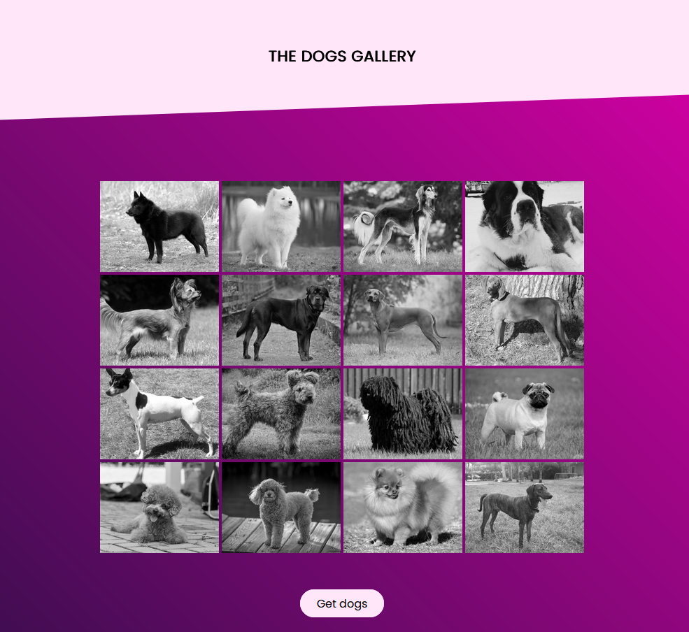
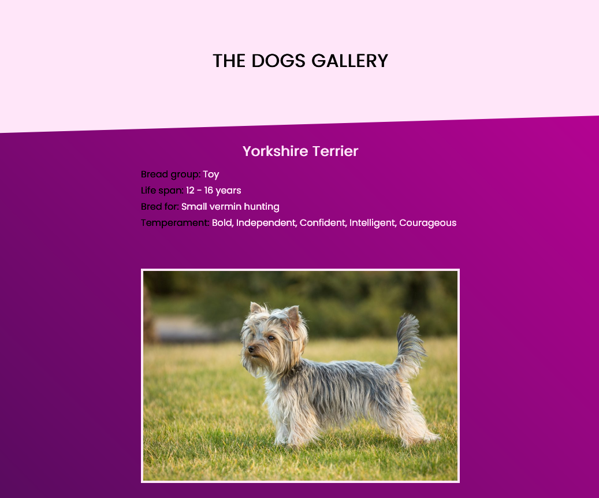

# Angular Dogs Gallery

Angular dogs gallery with RxJS.

## Browser Compatibility

All of the latest versions of <b>Chrome</b>, <b>Firefox</b>, <b>Edge</b> and <b>Opera</b> browsers are supported.

## Installation

#### Steps to install

<ol>
  <li>download the folder/git clone the repo</li>
  <li>cd root directory of the folder</li>
  <li>npm install</li>
  <li>ng serve -o</li>
  <li>access localhost:4200 on your browser</li>
</ol>

## Screenshots

Homepage shows the first 15 dogs. Clicking the Get dogs button displays an additional 15 dogs (and so on).

Click on an individual dog to display the dog's information.

See code <a href="https://github.com/veronikagregorec/angular-dogs-gallery/tree/main/src/app">here</a>

[Back to the top](#angular-dogs-gallery)
